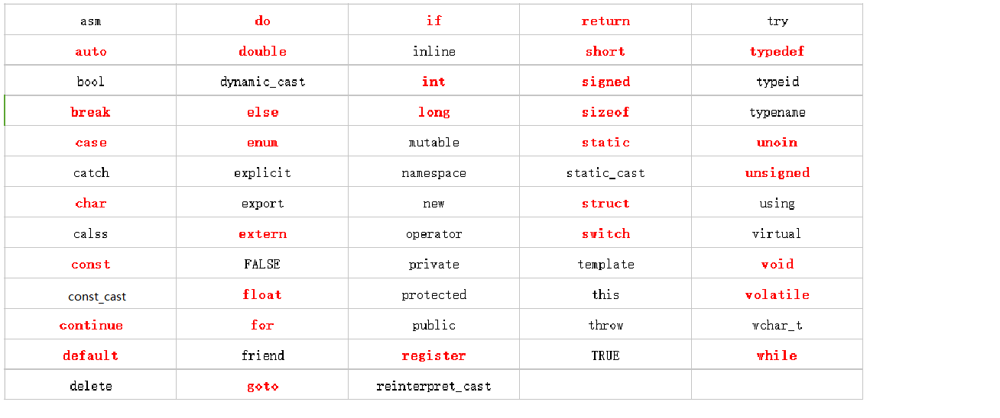

# C++ Keywords

Keyword in C!

<!--more-->

Today we'll talk about keywords in C

## What are keywords

So before we talk about keywords, first we need to know what the definition of a keyword is.

Keywords are predefined reserved identifiers that have a special meaning and cannot be used as identifiers in a program. Some of our common keywords are

###  Keywords?



This is a list of C++ 98/03 keywords I found on the web, where the 32 keywords in C are marked in red.

In C++ 11, there are 73 keywords, and the new ones are alignas, alignof, char16_t, char32_t, constexpr, decltype, noexpect, nullptr, static_assert, thread_local.

Next we have a brief explanation of the more commonly used keywords

### auto

This keyword usage is just like its name, it will automatically shorten the data type of the variable, but we should note that not every compiler supports auto

```
auto x=1; // Here the variable x is initialized using the integer 1, then the type of x is inferred to be an int integer type.
auto y=3.14159; // Here the variable y is initialized using the floating point number 3.14159, then the type of y is inferred to be a float floating point type.

```

### ***_cast

The cast keyword is added after it for C++ style type conversion

1. const_cast

    const_castis simplest, it removes the attributes of a const variable so that the type of data being converted can be changed

2. dynamic_cast

    dynamic_cast is a top-down conversion from a parent object pointer to a derived object pointer or reference.

3. static_cast
    
    Compared to dynamic_cast, static_cast is mostly used to convert a pointer of a derived object to a parent object, and is a bottom-up conversion.

4. reinterpret_cast

    reinterpret_cast is a more dangerous type of conversion, it can convert one type to a different type, it can work on two completely unrelated type conversion


### break 、 continue    

I often confuse these two keywords, in fact, we just need to understand the literal meaning, break is to stop, as the name suggests is to jump out of the current cycle, no longer continue the cycle, directly to the next step, and continue is to continue, that is to say, skip this cycle, continue the next cycle.

### do、for、while

They are part of the loop statement and are supported by both C and C++.

### if else 

These two are part of the conditional statement, if means what condition is satisfied, else generally means that the condition is not satisfied.

### public、private、protected、friend

You should be familiar with these keywords

private, can only be accessed in this class, derived classes and friends

public, access is not restricted, any class can access

protected, only this class and friend can access

friend, so that it is not restricted by access rights control. In fact, the existence of friend elements destroys the encapsulation of C++, so we suggest you reduce the use of friend elements.


Well, that's all for today! 

Hope you like it in front of the screen!
