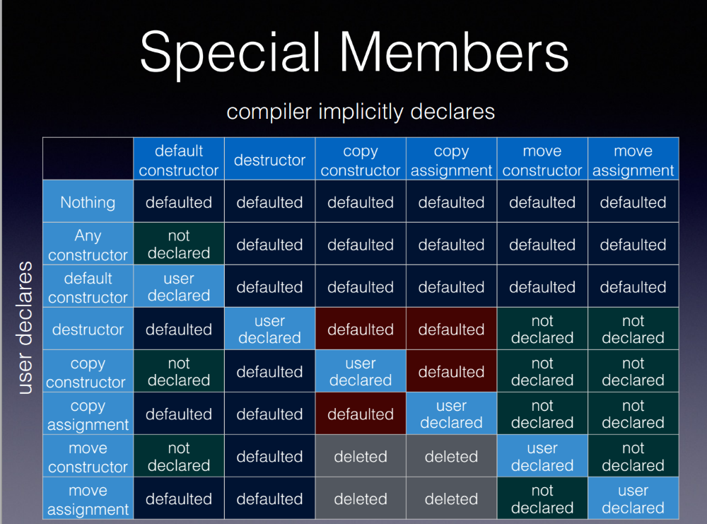

# Special members

C++ Class and Special members!

<!--more-->



##  6 Special members

We all know that OOP(object-oriented programming) is a feature of C++, and most of these objects have corresponding classes, and there are very important functions in the classes, which are the member functions we are going to discuss today.

As we can see from the figure above, there are six special member functions, and they are.

```
class A
{
public:
    A(); //constructor
    ~A(); //destructor

    A(const A& a); //copy constructor
    A(const&& a); //move constructor

    A& operator=(const A& a); //copy assignment
    A& operator=(A&& a); //move assignment
}
```

Combined with the text in the figure, we can easily see that when we do not declare any functions, the system will automatically declare them for us; but once we have declared them, the system will delete the automatically declared functions.

To put it simply, if we don't have one, the system uses its own; if we do, the system uses ours.

Here are a few more important things in conjunction with the characteristics of the class.

1. the constructor must not be a virtual function!

    Because the constructor is to create the object, and the virtual function needs to know the actual type of the object, if the constructor is defined as a virtual function, then there is no way to know the actual type of the object!

2. the destructor function better be a virtual function!

    The destructor function is defined as a virtual function can be a good solution to the base class derived classes after the type conversion of the destructor operation, to avoid the destructor of the wrong object or not the destructor of the right object.


## Rule of zero/three/five

Next let's talk about the 0/3/5 Rules, probably based on the literal meaning of the smart you know what it is. Yes! It is that we need to add how many functions.

### Rule of zero

The rule of zero, as the name implies, is not to define a single member function, because many times classes do not need destructors, copy/move constructors or copy/move assignments, and the compiler generates them by default to do the job just fine, so try to use the rule of zero if possible.

```
class A
{
public:
    // Rule of zero
}
```


### Rule of three

If you define a copy operation, remember to override the copy constructor and the copy assignment, otherwise sometimes the compiler will call the move equation because in its opinion the move operations is cheaper than a copy.

```
class A
{
public:
    ~A(); //destructor

    A(const A& a); //copy constructor
    A& operator=(const A& a); //copy assignment
}
```


### Rule of five

This rule is important, if you define a destructor yourself, then you have to define the copy constructor and copy assignment yourself, otherwise the default generated copy constructor and copy assignment will do the wrong thing; and also write the constructor and copy assignment with matching semantics. Then, for performance reasons, it is best to write the move constructor class move assignment as well.


```
class A
{
public:
    A(); 
    ~A(); 

    A(const A& a); 
    A(const&& a);

    A& operator=(const A& a); 
    A& operator=(A&& a); 
}
```

Well, that's all I have to share today! It's my final week of the semester, so I'm really busy. let's steal a lazy!

Heihei!


