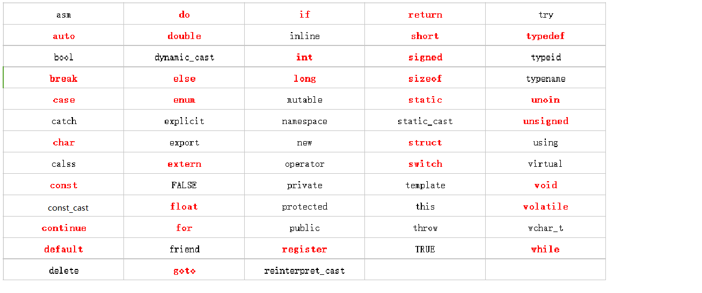

# C++ 关键字

C语言中的关键字！

<!--more-->

今天我们来说一下C语言中的关键字

## 关键字是什么

那在说关键字之前，首先我们要知道关键字的定义是什么。

关键字就是具有特殊意义的预定义保留标识符，它们不能用作程序中的标识符。我们常见的关键字有

### 关键字有哪些



这是我从网上找到的C++ 98/03关键字一览表，其中红色标注的是C语言的32个关键字。

而C++ 11中是有73个关键字的，新增的是个分别是 alignas、alignof、char16_t、char32_t、constexpr、decltype、noexpect、nullptr、static_assert、thread_local

接下来我们对比较常用的关键字进行简单的解释

### auto

这个关键词用法就像它的名字一样，会自动腿短变量的数据类型，但是我们要注意，不是每个编译器都支持auto的

```
auto x=1; // 这里使用整数1对变量x进行初始化，那么x的类型就被推断为int 整数型。
auto y=3.14159; // 这里使用浮点数3.14159对变量y进行初始化，那么y的类型就会被推断为float 浮点数类型。

```

### ***_cast

后面加上cast的关键字是C++风格的类型转换

1. const_cast

    const_cast就比较简单了，它就是删除const变量的属性，使得被转换的数据类型可以被改变

2. dynamic_cast

    dynamic_cast是将父类对象指针转换为子类对象指针或者引用，是一种自上而下的转换方式

3. static_cast
    
    相对于dynamic_cast，static_cast大多数用于子类对象指针向父类对象转换的情况，是一种自下而上的转换方式

4. reinterpret_cast

    reinterpret_cast是比较危险的一种转换，它可以将一种类型转换成另一种不同的类型，可以作用于两个完全不相关的类型转换


### break 、 continue    

我身边的小伙伴经常会把这两个关键字搞混，其实我们只需要理解字面意思就好了，break就是停下，顾名思义就是跳出当前的循环，不再继续这个循环了，直接进行下一步，而continue就是继续，也就是说跳过本次循环，继续下一次循环。

### do、for、while

他们是循环语句组成部分，C和C++都支持。

### if else 

这两个是条件语句的组成部分，if表示满足什么条件，else一般就是不满足这个条件。

### public、private、protected、friend

大家应该对这些关键字不陌生

private 私有，只能在本类，派生类和友元中访问

public 公有，访问不受限制，任何类都可以访问

protected 保护，只有本类和友元可以访问

friend 友元，使其不受访问权限控制的限制。其实友元的存在破坏了C++的封装性，建议大家减少有友元的使用


好了，这就是今天的内容！ 

希望屏幕前的你喜欢！

